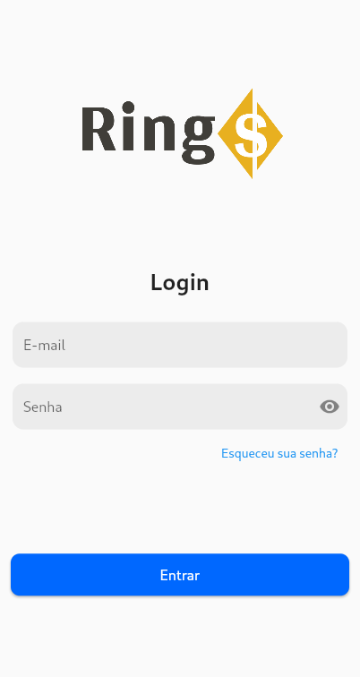
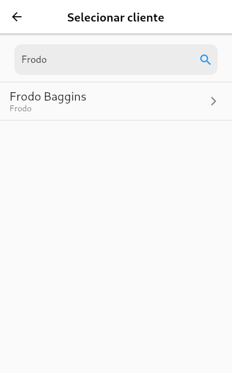

# rings

Rings é um banco fictício para um trabalho da disciplina de Introdução a Engenharia de Software (UFSJ).
Essa aplicação foi feita com o frontend em Flutter e o backend com Hasura (Postgres) + nodejs (auth)

<p align="center">
	 
</p>

## Conteúdos

1. [Arquitetura](#Arquitetura)
	- [Estrutura de pastas](#estrutura-de-pastas)
		- [Backend](#backend)
		- [Frontend](#frontend)
2. [Escolha de tecnologias](#escolha-de-tecnologias)
	- [Flutter](#flutter)
	- [Hasura](#hasura)
	- [Node](#node)
	- [Docker](#docker)
3. [Funcionalidades implementadas](#funcionalidades-implementadas)
	- [Login](#login)
	- [Cadastrar cliente](#cadastrar-cliente)
	- [Selecionar cliente](#selecionar-cliente)
	- [Visualizar dados](#visualizar-dados)
	- [Contratar serviço](#contratar-serviço)
4. [Autores](#autores)

## Arquitetura

Foram escolhidos dois padrões arquiteturais: `Arquitetura em Camadas` e o `Padrão MVC`.

- A `Arquitetura em Camadas` foi utilizada para separar o frontend, que é responsável por exibir as informações na tela e interagir com o usuário, do backend, que cuida da manipulação e validação correta dos dados emitidos e recebidos do banco de dados. 

- Já o `Padrão MVC` foi aplicado, exclusivamente, no frontend. O Model gerencia as estruturas de dados e cuida da lógica e regras de negócio, a View exibe as informações para o usuário, e por fim, o Controller é responsável por intermediar as requisições enviadas pela View com as respostas fornecidas pelo Model.


### Estrutura de pastas

A pasta raiz do projeto é dividida em duas pastas principais, uma para cada camada (backend + frontend)

```
├── backend
├── frontend
```

#### Backend

O backend é dividido em mais duas pastas, uma para as configurações do `Hasura` e outra para um pequeno server feito em node para autenticação.

```
backend
├── docker-compose.yaml
├── hasura
│   ├── metadata
│   ├── migrations
|		...
└── node
    ├── Dockerfile
    └── server.js
		...
```

O arquivo `docker-compose.yaml` é usado para subir todo o backend usando Docker.

#### Frontend

A pasta de frontend contém os arquivos comuns para um projeto em `Flutter`.

- A pasta `lib` contém os todos os códigos escritos em Dart
- A pasta `assets` contém imagens usadas no projeto
- A pasta `test` contém os testes do projeto


## Escolha de tecnologias

Abaixo estão listadas as tecnologias que foram usadas e porque as escolhemos.


### Flutter

O Flutter é um toolkit de interface gráfica criado pela Google para o desenvolvimento de aplicações multiplataformas (Android, iOS, Web, ...). Escolhemos esse framework porque ele oferece facilidade na criação de intefaces gráficas de alto nível. Além disso, ele utiliza a linguagem Dart que é parecida com outras linguagens que já utilizamos.


#### Packages utilizados 

Abaixo estão listados os packages (dependências externas) que mais foram utilizados ao longo do projeto.

- `Getx` - Flutter microframework - Agiliza o desenvolvimento, provendo gerenciadores de estado, rotas nomeadas, injeção de dependência, ...
- `hasura_connect` - Hasura client - Provê uma conexão simples com o Hasura. Usado para consultas ao banco
- `dartz` - Functional programming - Esse package pode ser usado para implementar o paradigma funcional com Dart. Porém, nesse projeto utilizamos apenas a classe Either, isso porque ela ajuda no tratamento de falhas

### Hasura

O Hasura é uma engine GraphQL open-source que entrega uma api amigável em GraphQL para aplicações com Postgres. Ele consegue ter um alto desempenho por manter um schema json que é usado para otimizar as requisições futuras. Além disso, ele tem um bom e fácil de usar esquema para controle de acesso às tabelas/dados. Apesar disso, ele não possui um sistema próprio de autorização

### Node

Como dito acima, o Hasura não provê um sistema próprio de autorização. Por isso, utilizamos Node para criar um simples server que é responsável por encriptar/verificar senhas e criar tokens `JWT`.

> **_JWT:_** JSON Web Token é um padrão para a criação de dados com assinatura opcional e/ou criptografia cujo payload contém o JSON que afirma algum número de declarações. 

Principais dependências:
- `bcryptjs` - Encripta/verifica senhas
- `express` - Framework para servidor
- `graphql` - Requisições graphql (Hasura)
- `jsonwebtoken` - Gera, assina e valida tokens JWT

### Docker

O Docker é um projeto open-source, que agiliza o processo de desenvolvimento e deploy de aplicações dentro de containers isolados. Utilizamos ele para subir e configurar o 
ambiente do backend. Para a configuração também utilizamos o `docker-compose`


## Funcionalidades implementadas

Para o tempo estabelecido, não conseguimos implementar todas as funcionalidades requeridas. Abaixo estão listadas tanto as que foram implementadas quanto as que ficaram de fora dessa primeira versão.

### Login

O login foi criado para que um funcionário fictício previamente cadastrado pudesse entrar no sistema. E é a funcionalidade que utiliza do pequeno server em Node, que tem implementado as funções de signup e signin. O cadastro necessita de uma senha que fica salva no banco de dados encriptada (`bcryptjs`). Para o signin é verificado se a senha da tentativa corresponde a que está armazenada no banco, também precisando do email para identificar o funcionário.

Caso o email utilizado para a tentativa de login não exista na base de dados é retornado um erro do backend avisando que aquele email não existe. E, caso a senha esteja errada o erro retornado é senha inválida (poderia ser melhorado, tendo em vista a segurança, a partir de um email é possível saber se o funcionário está cadastrado ou não).

Para a chamada do server em Node foram feitas duas Hasura actions (signin e signup). Essas actions oferecem uma interface Graphql para uma chamada de API. Abaixo está um exemplo de cadastro e login utilizando do Graphql para puxar apenas os dados necessários.

<p align="center">
	 
</p>

O token retornado é um token de sessão `JWT` que possui um pequeno payload com informações do funcionário, que são necessárias para a autorização das requisições após o login. Esse token também possui uma validade, no caso de apenas 1 hora. A cada nova requisição feita pelo funcionário a assinatura do token é verificada com a chave privada.

No aplicativo não foi implementado um mecanismo para guardar o token entre sessões. Por isso, a cada vez que o aplicativo é aberto o usuário tem que logar novamente.


### Cadastrar cliente

Após o login o funcionário vai para a tela inicial, onde ele tem a opção de cadastrar um novo cliente. Nessa tela, ele preenche os dados do cliente e ao confirmar é feita a requisição ao banco.
Abaixo uma screenshot do formulário. Obs.: a tela tem um scroll, por isso o campo endereço não aparece

<p align="center">
	
</p>

Ao tentar fazer a requisição ao banco é retornado um erro para os seguintes casos:
- CPF inválido: Caso o CPF não esteja no formato correto
- CNPJ inválido: O CNPJ pode ser nulo para indicar uma pessoa física, mas será inválido caso o seu texto não esteja no formato correto
- Dados pessoais nulos

Após confirmar e com os dados corretos o cliente será cadastrado.


### Selecionar cliente

Na tela inicial o funcionário também pode escolher realizar uma nova operação para o cliente, para isso ele é enviado à tela de selecionar cliente. 
É feita uma requisição ao banco para puxar todos os clientes e seus dados, após isso o funcionário pode pesquisar o cliente desejado por nome, apelido, CPF ou CNPJ.

<p align="center">
	 
</p>

Caso ocorra algum erro na requisição ou não tenha nenhum cliente cadastrado, é mostrado um botão com a opção de tentar novamente.

Ao clicar em algum dos clientes, o funcionário é enviado para a tela de nova operação, onde ele escolhe qual operação ele deseja realizar.


### Visualizar dados

Essa é uma operação que o funcionário pode fazer após selecionar o cliente. Nessa tela são mostrados os principais dados do cliente, dentre eles os dados da conta, dados pessoais e os serviços contratados

<p align="center">
	 
</p>


### Contratar serviço

Essa é uma operação que o funcionário pode fazer após selecionar o cliente. 
Nessa tela são listados todos os serviços do banco, podendo realizar uma busca por nome. 
À direita de cada item está um marcador indicando se aquele serviço está contratado ou não. 
Ao clicar em algum dos itens será feita uma requisição para contratar/descontratar o serviço.

<p align="center">
	 
</p>


<br>

## Autores

- [Carlos Mito - @CarlosMito](https://github.com/CarlosMito)
- [Marcos Fonseca - @marcosfons](https://github.com/marcosfons)
- [Vitor Lara - @vitorsvl](https://github.com/vitorsvl)