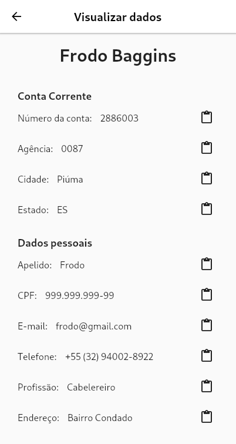

# rings

Rings é um banco fictício para um trabalho da disciplina de Introdução a Engenharia de Software (UFSJ).
Essa aplicação foi feita com o frontend em Flutter e o backend com Hasura (Postgres) + nodejs (auth)

<p align="center">
	 
</p>

## Conteúdos

1. [Arquitetura](#Arquitetura)
	- [Estrutura de pastas](#estrutura-de-pastas)
		- [Backend](#backend)
2. [Escolha de tecnologias](#escolha-de-tecnologias)
3. [Autores](#autores)

# Arquitetura

Foram escolhidos dois padrões arquiteturais: `Arquitetura em Camadas` e o `Padrão MVC`.

- A `Arquitetura em Camadas` foi utilizada para separar o frontend, que é responsável por exibir as informações na tela e interagir com o usuário, do backend, que cuida da manipulação e validação correta dos dados emitidos e recebidos do banco de dados. 

- Já o `Padrão MVC` foi aplicado, exclusivamente, no frontend. O Model gerencia as estruturas de dados e cuida da lógica e regras de negócio, a View exibe as informações para o usuário, e por fim, o Controller é responsável por intermediar as requisições enviadas pela View com as respostas fornecidas pelo Model.


## Estrutura de pastas

A pasta raiz do projeto é dividido em duas pastas principais, uma para cada camada (backend + frontend)

```
├── backend
├── frontend
```

### Backend

O backend é dividido em mais duas pastas, uma para as configurações do `Hasura` e outra para um pequeno server feito em node para autenticação.

```
backend
├── docker-compose.yaml
├── hasura
│   ├── metadata
│   ├── migrations
|		...
└── node
    ├── Dockerfile
    └── server.js
		...
```

O arquivo `docker-compose.yaml` é usado para subir todo o backend usando Docker.

### Frontend

A pasta de frontend contém os arquivos comuns para um projeto em `Flutter`.

- A pasta `lib` contém os todos os códigos escritos em Dart
- A pasta `assets` contém imagens usadas no projeto
- A pasta `test` contém os testes do projeto


# Escolha de tecnologias

Abaixo estão listadas as tecnologias que foram usadas e porque as escolhemos.


## Flutter

O Flutter é um toolkit de interface gráfica criado pela Google para o desenvolvimento de aplicações multiplataformas (Android, iOS, Web, ...). Escolhemos esse framework porque ele oferece facilidade na criação de intefaces gráficas de alto nível. Além disso, ele utiliza a linguagem Dart que é parecida com outras linguagens que já utilizamos.


### Packages utilizados 

Abaixo estão listados os packages (dependências externas) que mais foram utilizados ao longo do projeto.

- `Getx` - Flutter microframework - Agiliza o desenvolvimento, provendo gerenciadores de estado, rotas nomeadas, injeção de dependência, ...
- `hasura_connect` - Hasura client - Provê uma conexão simples com o Hasura. Usado para consultas ao banco
- `dartz` - Functional programming - Esse package pode ser usado para implementar o paradigma funcional com Dart. Porém, nesse projeto utilizamos apenas a classe Either, isso porque ela ajuda no tratamento de falhas

## Hasura

O Hasura é uma engine GraphQL open-source que entrega uma api amigável em GraphQL para aplicações com Postgres. Ele consegue ter um alto desempenho por manter um schema json que é usado para otimizar as requisições futuras. Além disso, ele tem um bom e fácil de usar esquema para controle de acesso às tabelas/dados. Apesar disso, ele não possui um sistema próprio de autorização

## Node

Como dito acima, o Hasura não provê um sistema próprio de autorização. Por isso, utilizamos Node para criar um simples server que é responsável por encriptar/verificar senhas e criar tokens `JWT`.

> **_JWT:_** JSON Web Token é um padrão para a criação de dados com assinatura opcional e/ou criptografia cujo payload contém o JSON que afirma algum número de declarações. 

Principais dependências:
- `bcryptjs` - Encripta/verifica senhas
- `express` - Framework para servidor
- `graphql` - Requisições graphql (Hasura)
- `jsonwebtoken ` - Gera, assina e valida tokens JWT

## Docker


<br>

## Autores

CarlosMito - @CarlosMito
Marcos Fonseca - @marcosfons
Vitor Lara - @vitorsvl